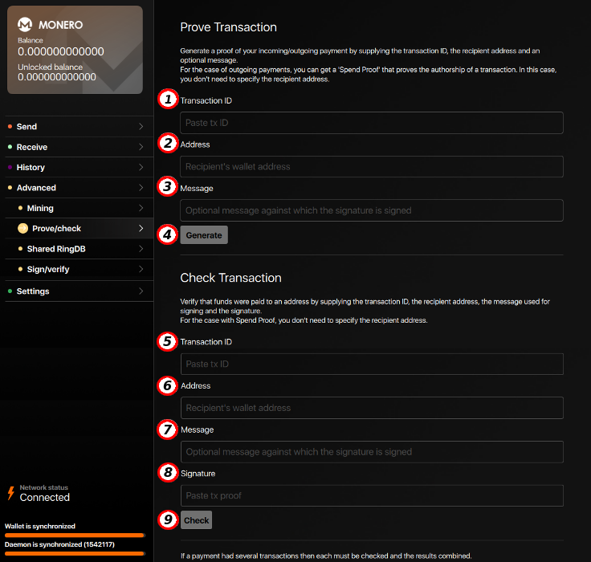

# Advanced Features

## 5.1 Solo mining

The Mining tab provides a one click CPU miner that is embedded into the GUI.

**(1) CPU threads:** Number of CPU threads to use for mining.    
**(2) Background mining:** Check this box to enable experimental background mining. This should allow you to use your computer normally while mining.    
**(3) Start mining:** Start the miner.    
**(4) Stop mining:** Stop the miner.    

## 5.2. Prove - Check

The `Prove/check` tab provides tools for proving a payment or validating proof of a payment. This is necessary with Monero because these details are not available on the blockchain.

### 5.2.1. Prove Transaction

This will generate a proof that you made a payment to a certain address. You need to put the following information:

**(1) Transaction ID:** This is the ID of the payment you are creating proof for. You can find the transaction details by selecting the History tab from the left menu.    
**(2) Address:** This is the address you are proving payment to.    
**(3) Message (optional):** This an optional message that will be signed with the transaction details. If you choose to include a message then the other party must also include the exact same message in order to verify your proof.    
**(4) Generate:** Click here once you've entered all the details to generate your proof.
&nbsp;

A detailed guide is available on getmonero.org: ['How to prove payment'](https://getmonero.org/resources/user-guides/prove-payment.html)

### 5.2.2. Check Transaction

This will verify that a payment was made. You need to put the following information:

**(5) Transaction ID:** This is the ID of the payment you are attempting to verify.    
**(6) Address:** This is the receiving address of the payment you are attempting to verify.    
**(7) Message (optional):** This is the optional message that may have been included with the proof.    
**(8) Signature:** This is the signature generated to prove payment.    
**(9) Check:** Click here once you've entered all the details to check that the transaction proof is valid.    

## 5.3. Shared RingDB

This is an advanced tool that can be used to improve the privacy of ring signatures. The outputs used in ring signatures can be adapted to mitigate the privacy loss when using a key-reusing fork or to avoid outputs that could not be spent in this transaction.

**(1) Blackball filename:** This tool will blackball outputs that are known to be spent. After running monero-blockchain-blackball, import the resulting file to avoid using these outputs as decoys in constructed ring signatures. This file is stored in the .shared-ringdb folder by default.    
**(2) Blackball output:** This will blackball or unblackball a chosen single output. Outputs are represented by 64-character strings. The outputs added in this field will not be used as decoys in constructed ring signatures. Unblackballed outputs may (but will not necessarily) by used as decoys.    
**(3) Key image input:** Add the key image that was used on the key-reusing fork.    
**(4) Get ring:** Press the "Get Ring" button to get the ring members for the given key image in 3.    
**(5) Set ring:** Press the "Set Ring" button to set the ring members for a transaction. Copy the ring members from 4 to get those for the key image, or manually type in your own.    
**(6) Intent to spend:** Select this if you are certain that you will spend Monero on a key-reusing fork. This will aggressively modify the input selection algorithm to give you the greatest plausible deniability.    
**(7) Possibility to spend:** Select this if you may spend Monero on a key-reusing fork. This will modify the input selection algorithm. Uncheck this only if you are certain you will not use a key-reusing fork.    
**(8) Relative:** When selected, the offsets are encoded relative to the previous, as opposed to absolute (transactions use relative offsets).    
**(9) Segregation height:** The block height at which the key-reusing fork splits.    

## 5.4. Sign - verify

The `Sign/verify` tab provides tools for signing a message or file with your private key or verifying the authenticity of a singed message or file.

### 5.4.1. Sign

**(1) Message:** This is where you can enter a message to be signed.    
**(2) Message from file:** This is where you can choose a file to be signed. Click Browse to navigate the file system.    
**(3) Signature:** This is where your unique signature will appear once you click the Sign button. This is linked to your private key and the message or file you entered. It will be given as proof along with the message or file which was signed.    

### 5.4.2. Verify

**(4) Verify message:** This is where you will put a message that has been signed.    
**(5) Verify file:** This is where you enter the path to a file that has been signed. Click Browse to navigate the file system.    
**(6) Address:** This is where you will enter the public Monero address of the signer.    
**(7) Signature:** This is where you will enter the signature you are verifying. Once all the required information has been entered click the Verify button. A pop-up will tell you if the signature is valid.    

