
 
   

 
  <h1>Guide for the Monero GUI wallet</h1>
  <i>All you need to understand every single part of your Monero wallet, plus some useful tips</i>
  
v1.8

&nbsp;

-   [Preface](#preface)
    -   [Translations](#translations)
    -   [Windows Preparation](#windows-preparation)
    -   [Shortcuts](#shortcuts)
-   [Welcome](#welcome)
    -   [Choose a Language](#choose-a-language)
    -   [Choose wallet mode](#choose-wallet-mode)
    -   [About the Simple/Bootstrap
        mode](#about-the-simplebootstrap-mode)
-   [Create a Wallet](#create-a-wallet)
    -   [Create new wallet](#create-new-wallet)
        -   [Add a password](#add-a-password)
        -   [Daemon settings](#daemon-settings)
        -   [Starting a local node (full
            node)](#starting-a-local-node-full-node)
    -   [Create new wallet from
        hardware](#create-new-wallet-from-hardware)
        -   [How hardware wallets work with Monero
            GUI](#how-hardware-wallets-work-with-monero-gui)
        -   [Prepare your device](#prepare-your-device)
        -   [Create a wallet from your hardware wallet
            device](#create-a-wallet-from-your-hardware-wallet-device)
        -   [Ledger troubleshooting](#ledger-troubleshooting)
        -   [Trezor troubleshooting](#trezor-troubleshooting)
        -   [Add a password](#add-a-password-1)
        -   [Daemon settings (Advanced
            mode)](#daemon-settings-advanced-mode)
        -   [Starting a local node (full
            node)](#starting-a-local-node-full-node-1)
        -   [Receive and Send Monero with your hardware
            wallet](#receive-and-send-monero-with-your-hardware-wallet)
    -   [Restore wallet from keys or mnemonic
        seed](#restore-wallet-from-keys-or-mnemonic-seed)
        -   [Restoring from seed](#restoring-from-seed)
        -   [Restoring from keys](#restoring-from-keys)
    -   [Open a wallet from file](#open-a-wallet-from-file)
-   [Synchronization](#synchronization)
    -   [Daemon synchronization](#daemon-synchronization)
        -   [Daemon synchronization with local
            node](#daemon-synchronization-with-local-node)
        -   [Daemon synchronization with remote
            node](#daemon-synchronization-with-remote-node)
        -   [Block height](#block-height)
    -   [Wallet synchronization](#wallet-synchronization)
        -   [Wallet restore height](#wallet-restore-height)
        -   [How to change Wallet restore height / Wrong or zero balance
            after
            synchronizing](#how-to-change-wallet-restore-height-wrong-or-zero-balance-after-synchronizing)
        -   [How to speed up wallet initial
            synchronization](#how-to-speed-up-wallet-initial-synchronization)
-   [Monero Account](#monero-account)
-   [Send Monero](#send-monero)
    -   [Address Book](#address-book)
-   [Receive Monero](#receive-monero)
    -   [Merchant mode](#merchant-mode)
-   [Transactions History](#transactions-history)
-   [Advanced Features](#advanced-features)
    -   [Solo mining](#solo-mining)
    -   [Prove - Check](#prove---check)
        -   [Prove Transaction](#prove-transaction)
        -   [Check Transaction](#check-transaction)
    -   [Shared RingDB](#shared-ringdb)
    -   [Sign - verify Message](#sign---verify-message)
        -   [Sign](#sign)
        -   [Verify](#verify)
    -   [Sign - verify File](#sign---verify-file)
        -   [Sign](#sign-1)
        -   [Verify](#verify-1)
-   [Settings](#settings)
    -   [Wallet](#wallet)
    -   [Interface](#interface)
    -   [Local Node](#local-node)
    -   [Remote Node](#remote-node)
    -   [Log](#log)
    -   [Info](#info)
    -   [Seed and keys](#seed-and-keys)
-   [Binaries Verification](#binaries-verification)
-   [About remote nodes](#about-remote-nodes)
    -   [Bootstrap nodes](#bootstrap-nodes)
-   [Common issues and solutions](#common-issues-and-solutions)

Preface
=======

This guide is open source and maintained by ErCiccione, of the Monero
community. If you have suggestions or wish to contribute to the
development of this guide, feel free to open Pull Requests or Issues on
the GitHub repository where this document is maintained:
[github.com/monero-ecosystem/monero-GUI-guide](https://github.com/monero-ecosystem/monero-GUI-guide).
 

For the online version of this guide, click
[here](https://github.com/monero-ecosystem/monero-GUI-guide/blob/master/monero-GUI-guide.md)

Translations
------------

This document will be localized into several languages. You will find
all available translations in the [dedicated section on
GitHub](https://github.com/monero-ecosystem/monero-GUI-guide/tree/master/translations)
after the next version (1.6) of this guide will be released.

Windows Preparation
-------------------

If you are on Windows:

-   Make sure that your antivirus does not block the program.

A miner is included in the Monero GUI software and, as a result, most
anti virus software flags the Monero GUI files as malware and
subsequently quarantines them. Fortunately, however, there's a fairly
trivial work around you can use. That is:

-   Create a new directory / folder.

-   Open your AV software.

-   Add an exception for the newly created directory / folder. Put
    differently, you have to whitelist the newly created directory /
    folder.

-   Extract the .zip file (in case of Windows) or the .tar.bz2 file (in
    case of Linux or Mac OS X) to the whitelisted directory / folder.

    *Note:* if you're using Windows and did not install custom anti
    virus software, Windows Defender is, most likely, acting as active
    anti virus software.

-   The first time you start the wallet you must give permission to
    connect to the network via a pop-up. Check the appropriate boxes and
    click `Allow access`.

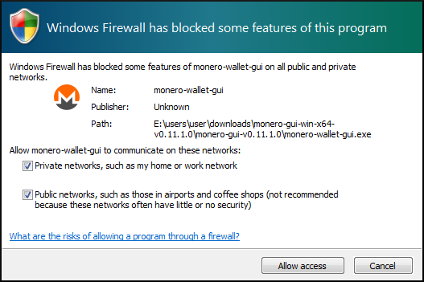

Shortcuts
---------

Some shortcuts are available to make the user experience with the GUI
easier:  

**On all operating systems:**\
Press `Ctrl` to view each page shortcut. Press `ctrl+"shortcut"` to go
to that page  

**On Linux/Windows:**\
`ctrl + tab` -\> go to the next page\
`ctrl + shift + tab` -\> go to the previous page  

**On macOS:**\
`cmd + tab` -\> go to the next page\
`cmd + shift + tab` -\> go to the previous page

Welcome
=======

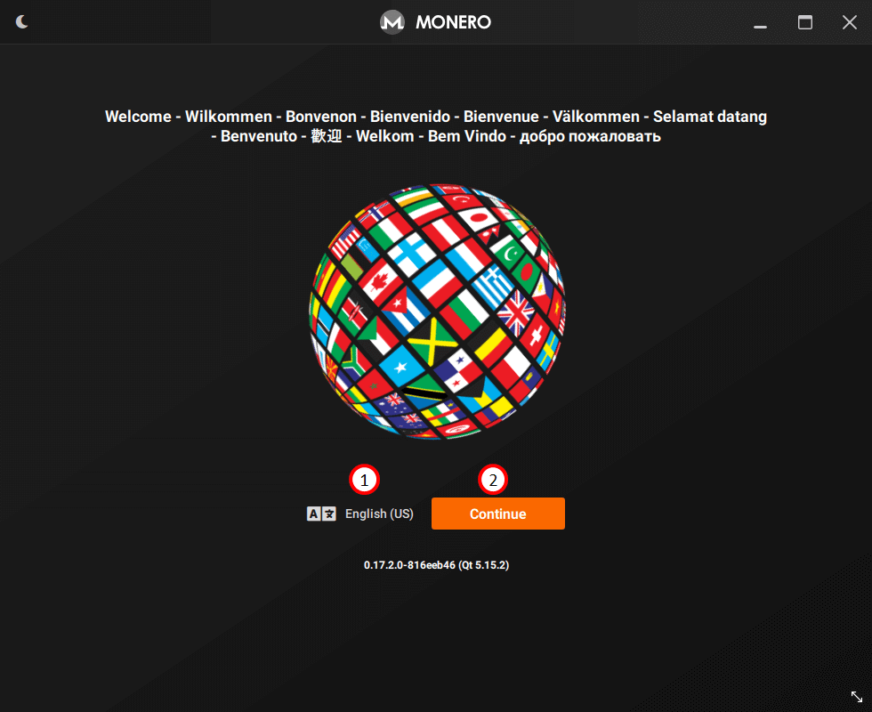

Extract the package and click on `monero-wallet-gui`.

Welcome to Monero GUI Wallet.

(1) **Language:** Click here to see a list of available languages.\
(2) **Continue:** If you are satisfied with the current language,
    continue to the next screen.

Choose a Language
-----------------

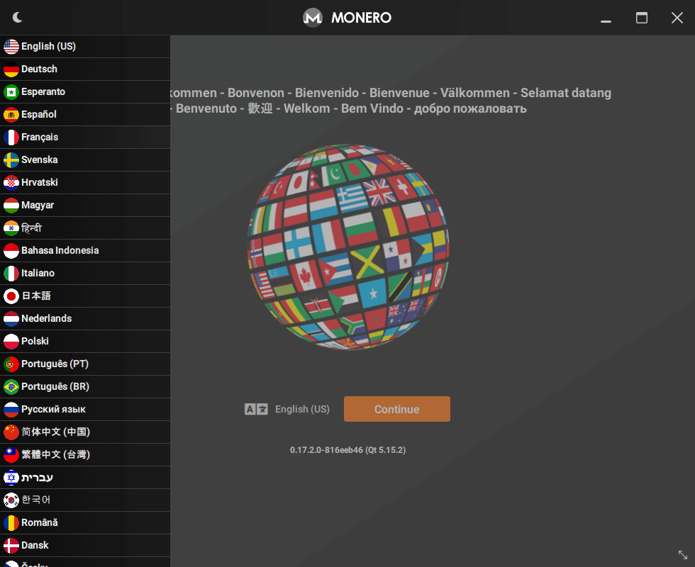

You'll see a list of available languages, click on the one of your
choice to change it and continue from the welcome screen. *Note:* You
will be able to change the language later by clicking on the *flag* in
the upper-left corner.

(1) **Close:** Cancel and return to the previous screen.

Choose wallet mode
------------------

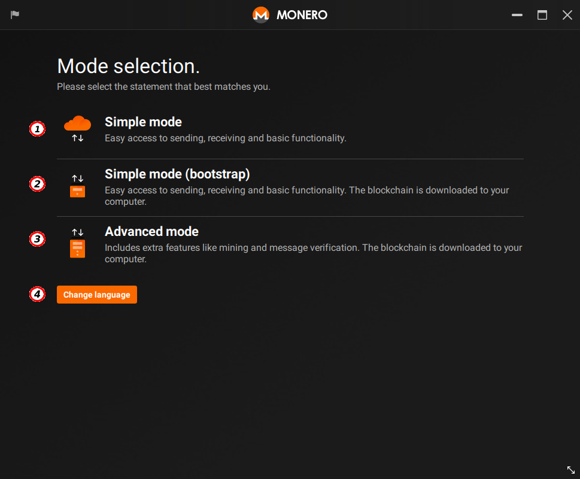

This page lets you choose the mode that best suits your accessibility
and privacy needs.\
*Note:* Stagenet and Testnnet only supports *Advanced mode*.

(1) **Simple mode:** In this mode your wallet will display a simple
    interface with easy access to basic functionality like sending,
    receiving, transactions history, address book, accounts, and
    merchant mode, as well as hardware wallet support. It will start a
    local node on your computer, but the blockchain will not be downloaded.
    Instead, the local node will forward requests to a user-run remote
    node. Choose this option if you don't have enough space to store the
    blockchain file (more than 100 GB), if you don't require maximum
    privacy, and you accept the privacy risks of relaying on remote nodes
    to connect to the Monero network.\
(2) **Simple mode (bootstrap):** In this mode your wallet will also
    display a simple interface with easy access to basic functionality.
    Additionaly, the local node will start downloading of the blockchain
    file (more than 100 GB), which can take several hours or even days to
    complete. While the blockchain file is being downloaded, your local
    node will temporarily connect to a user-run remote node, which will 
    allow you to start using Monero immediately. After downloading and
    synchronizing the blockchain and the wallet, your local node will only 
    temporarily connect to a remote node when your blockchain is out of
    date. Be aware that using a remote node (including in bootstrap mode)
    to connect to the Monero network may reduce your privacy.\
(3) **Advanced mode:** In this mode your wallet will display all
    advanced features available, like changing fees/transaction
    priority, solo mining, message verification, transaction
    proof/check, offline transaction signing, key images importing,
    custom remote node (including .onion remote nodes), custom bootstrap
    remote node, starting a local node without setting a bootstrap remote
    node (maximum privacy), changing blockchain location, and daemon log.
    In this mode you can choose if you want to connect to the Monero
    network via a remote node or a local node. If you decide to run a
    local node, the blockchain file will be downloaded. If you want to
    start using Monero immediately, you can also set a bootstrap remote
    node in the Settings \> Node page. To achieve maximum
    privacy in your connection to the Monero network, it's recommended
    to avoid using a remote nodes altogether and instead use advanced
    mode to start a local node without setting a bootstrap remote node.\
(4) **Change language:** This will let you choose the language from the
    startup page (again).

About the Simple/Bootstrap mode
-------------------------------

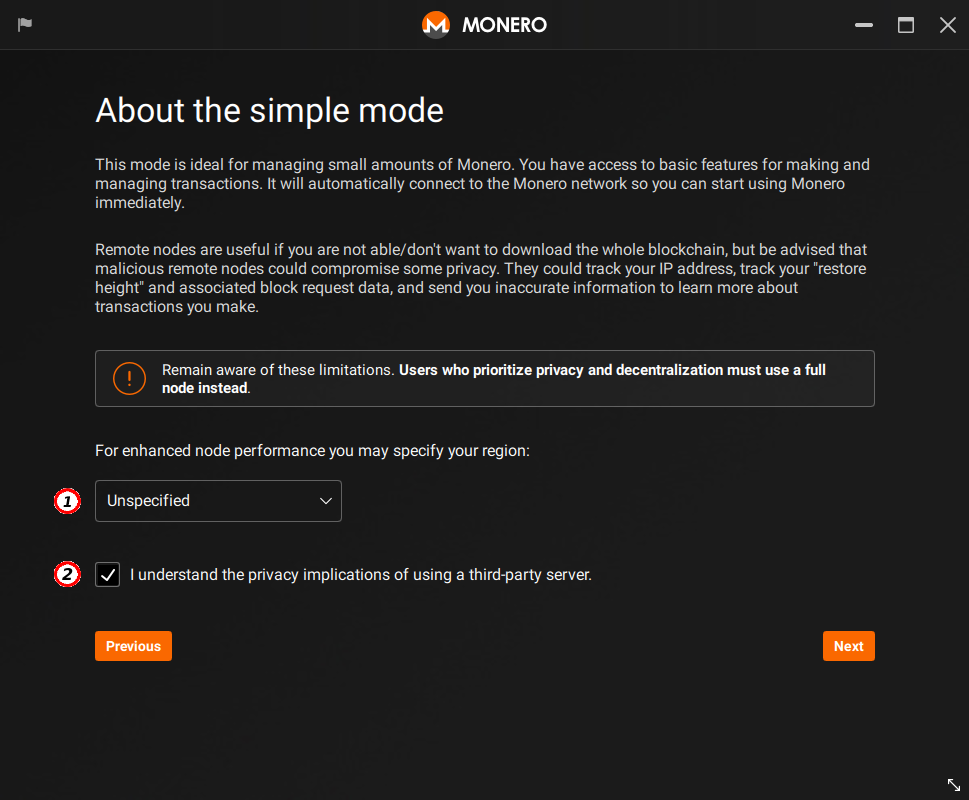

Upon choosing simple mode or bootstrap mode, an acknowledgement page
will be shown, explaining the features, behavior, and privacy
constraints of the mode.\
Please carefully read those informations before accepting the
implications of this mode and proceed to the next step.\
You must understand the inherent risks of using a remote node for your
privacy, and you should avoid using it with large amounts of money. If
you connect to a *malicious* remote node, it could track your IP
address, your "restore height" and associated block request data, and
send you inaccurate information to learn more about transactions you
make.

(1) **Region:** Choose a region to pick up the remote nodes from. The
    closer the node is, the better the wallet performance will be.\
(2) **Acknowledgement:** Check This box if you have **fully understood**
    the privacy implications of a remote node and agree to **weaken your
    privacy** by using it.

Create a Wallet
===============

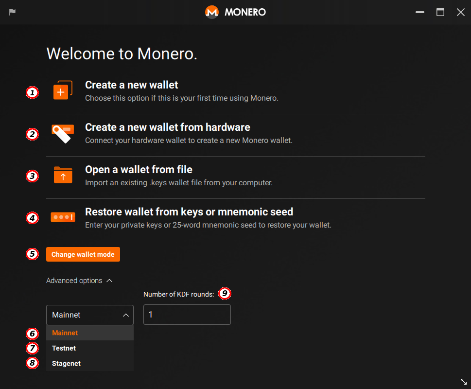

On this page you can create a new wallet, open an existing wallet,
change wallet mode or change choose how to connect to the wallet and to
the network:

(1) **Create a new wallet:** Start the procedure to create a new wallet
    file. Choose this option if this is your first time using Monero.\
(2) **Create new wallet from hardware:** Create a new wallet file from a
    hardware wallet device (e.g., Ledger or Trezor).\
(3) **Open a wallet from file:** Choose this option to select a
    pre-existing wallet file from your computer (with the extension
    `.keys`).\
(4) **Restore wallet from keys or mnemonic seed:** Click here if you
    want to recover a pre-existing wallet using the mnemonic seed or the
    private keys, creating a new wallet file.\
(5) **Change wallet mode:** Click here to switch between simple, simple
    (bootstrap), and advanced modes.

Advanced options (requires wallet in advanced mode):

(6) **Mainnet:** Select this from the dropdown list to use the main
    Monero network\
(7) **Testnet:** Select this option if you would like to use a
    development network instead of the main network. Testnet is designed
    to let developers test new features that are not available on
    Mainnet or Stagenet.\
(8) **Stagenet:** Select this option if you would like to use a network
    for staging instead of the main network. Stagenet mimics the
    features of Mainnet and is designed to let end users test Monero
    without the risk of losing funds.\
(9) **Number of KDF rounds:** Adjust the number of Key Derivation
    Function rounds in order to enhance the overall security of the
    generated keys. Any random large number will increase the security.

Create new wallet
-----------------

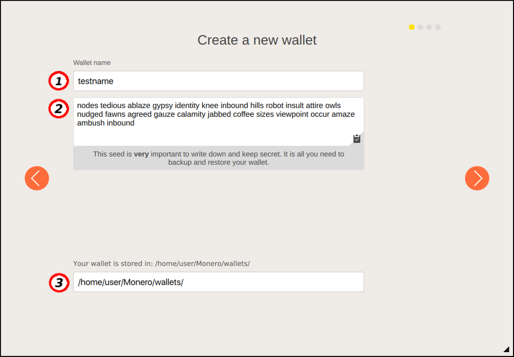

Here you can create a new wallet file:

(1) **Wallet name:** Give a name for your wallet (in this example
    `testname` is used).\
(2) **Mnemonic seed: Write down your [mnemonic
    seed](https://getmonero.org/resources/moneropedia/mnemonicseed.html)
    and keep it safe. Your seed is the master key of your wallet, you
    can use it to recover your funds.**\
(3) **Wallet location:** Select the destination folder of the wallet.

### Add a password

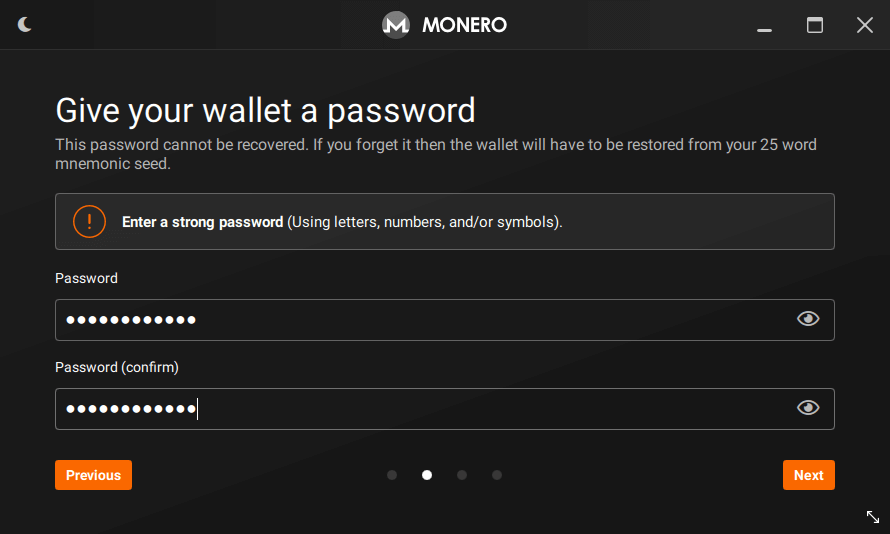

Add a strong password to protect your wallet. If you lose your password,
then only your mnemonic seed can recover your wallet.

### Daemon settings

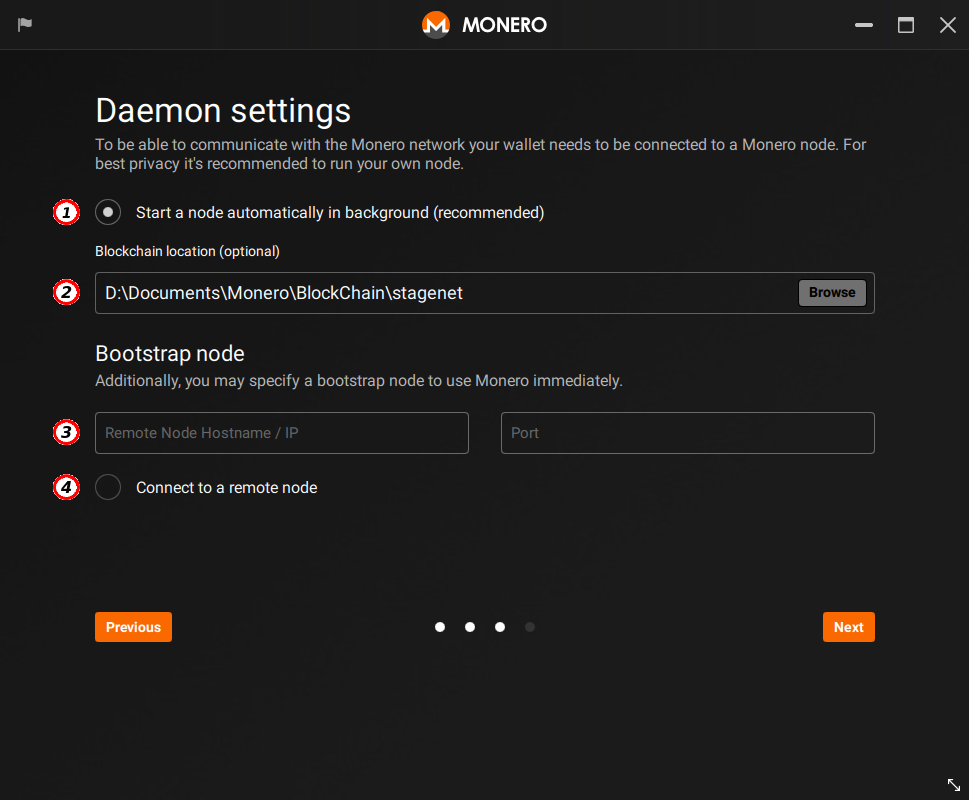

This page will open if your wallet is in advanced mode. Here you can
choose if you are going to start a local node or connect to a remote
node:

(1) **Start node in background:** Check this box to start a local node
    (full node) in the background and download the blockchain.\
(2) **Blockchain location (optional):** To store the blockchain
    somewhere other than default, enter that location here.\
(3) **Bootstrap node:** Here you can enter the host/IP address and port
    of a bootstrap node (remote node). Your local node will temporarily
    connect to this third-party remote node while the blockchain is
    being downloaded, allowing you to use your wallet immediately. For a
    list of available remote nodes and info about them, check the [About
    remote nodes](#about-remote-nodes) section of this guide.\
(4) **Connect to a remote node:** Check this box if you just want to use
    a remote node without downloading the blockchain. Enter the host/IP
    address and port of the remote node after checking the box.

### Starting a local node (full node)

If you have selected to start a local node, every time you open your
wallet you will see this pop up window:

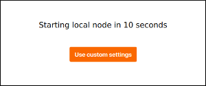

It has a countdown that allows you to change some settings before your
wallet connects to the local node. If you don't want to change any
setting, just let the countdown finish and your local node will be
started automatically.

Create new wallet from hardware
-------------------------------

Monero GUI currently supports the hardware wallet models Ledger Nano S/X
and Trezor Model T.

### How hardware wallets work with Monero GUI

-   The main function of your hardware wallet is to store your recovery
    seed in a device that never connects to the internet.
-   Your device has a single recovery seed, which is used to create
    Bitcoin and altcoins wallets, like Monero.
-   The recovery seed stored in your device will be used to generate two
    Monero private keys: a view key and a spend key.
-   Your private view key is exported from your hardware wallet device
    to the Monero GUI wallet.
-   Your private spend key never leaves your hardware wallet device. It
    is required to sign transactions.
-   How it works: 1) Monero GUI creates an unsigned transaction; 2) The
    unsigned transaction is sent to your hardware wallet device; 3) Your
    device asks if you want to confirm the transaction (sign the
    transaction with your private spend key); 4) After confirmed, the
    signed transaction is sent back to Monero GUI; 5) Monero GUI
    transmits the signed transaction to the Monero network

### Prepare your device

If you are using a Ledger Nano S/X, please make sure: + Your device is
plugged in and unlocked + Your device has already been initialized
before (your device already has a recovery seed) + Your device has the
most recent firmware version (available in Manager section of Ledger
Live desktop app) (see instructions for [Nano
S](https://support.ledger.com/hc/en-us/articles/360002731113-Update-Ledger-Nano-S-firmware)/[Nano
X](https://support.ledger.com/hc/en-us/articles/360013349800-Update-Ledger-Nano-X-firmware))
+ Your device has the Monero app installed (available in Ledger Live
desktop app) + Your device is running the Monero app + Your computer has
no other cryptocurrency wallet running in the background, like Ledger
Live

If you are using a Trezor Model T, please make sure: + Your device is
plugged in and unlocked + Your device has already been initialized
before (your device already has a recovery seed) + Your device has the
most recent firmware version (available in Trezor Wallet) ([see
instructions](https://wiki.trezor.io/Firmware_update)) + Your computer
has no other cryptocurrency wallet running in the background, like
Trezor Wallet

### Create a wallet from your hardware wallet device

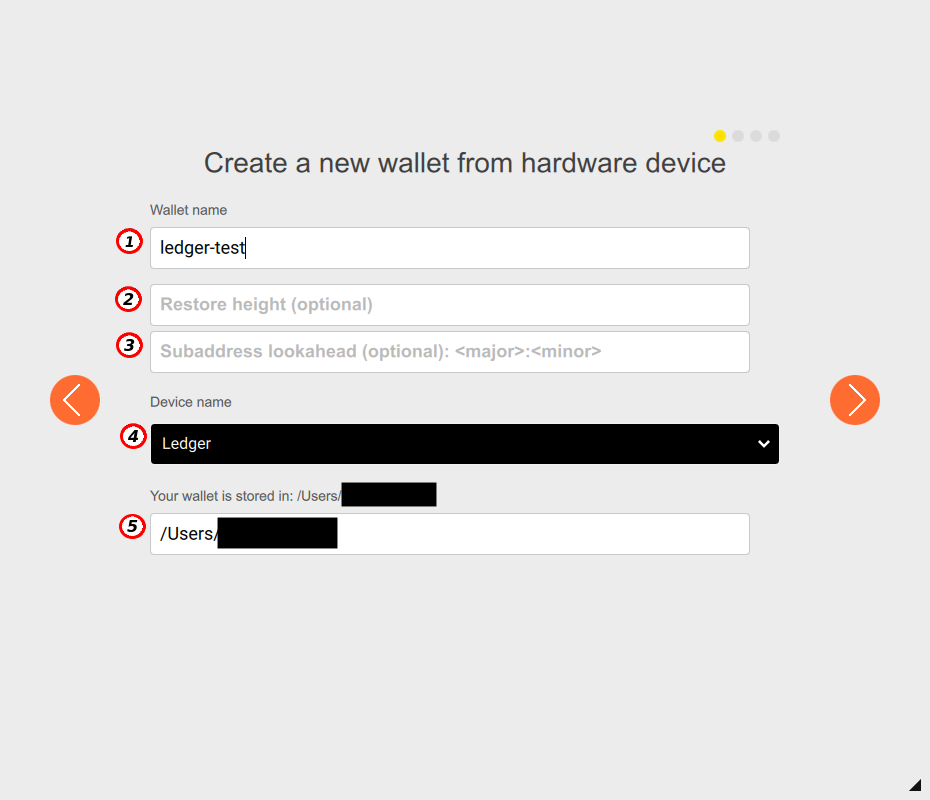

On this page you can create a new Monero wallet file from your hardware
wallet device. This wallet file will be stored in your computer and,
every time you open it, Monero GUI will ask you to connect and unlock
your hardware wallet. If your device is using a passphrase, your
passphrase will also be requested.

(1) **Wallet name:** Give a name for your wallet file (in this example
    `ledger-test` is used).\
(2) **Wallet location:** Select the destination folder of the wallet
    file.\
(3) **Create a new wallet from device:** Select this option if this is
    the first time you use a hardware wallet.\
(4) **Restore a wallet from device:** Choose this option if you already
    had a hardware wallet and want to restore it.\
    **Creation Date or Restore height (optional):** *Restore only:* If
    you know the date or block height that your wallet was created at,
    you can specify it here so the wallet doesn't have to scan the
    entire blockchain looking for your funds. For example, if your first
    transaction was included on `2017-07-08` in block `1350000`, you
    should put the previous day date (e.g. `2017-07-06`) or a slightly
    lower height (e.g. `1330000`) so the wallet will start scanning from
    there, saving you some time. More information about restore height
    on
    [StackExchange](https://monero.stackexchange.com/questions/7581/what-is-the-relevance-of-the-restore-height).\
(5) **Subaddress lookahead (optional):** pregenerate a number of
    accounts with a number of subaddresses each.\
(6) **Device name:** Select the hardware wallet you want to use. Monero
    GUI currently supports the hardware wallet models Ledger Nano S/X
    and Trezor Model T.

### Ledger troubleshooting

-   If you can't connect to your Ledger, try restarting your computer,
    using a different USB cable, changing the USB port, or connecting to
    a different computer. Avoid using USB hubs.
-   If your Monero GUI wallet is slow while using Ledger, make sure
    you're allowing your Ledger device to export the private view key to
    your computer. You should only export the private view key when
    using official Monero software.
-   Step by step guide for all operating systems (StackExchange): [How
    do I generate a Ledger Monero wallet with the GUI
    (monero-wallet-gui)?](https://monero.stackexchange.com/questions/9901/how-do-i-generate-a-ledger-monero-wallet-with-the-gui-monero-wallet-gui)

### Trezor troubleshooting

-   If you can't connect to your Trezor, try restarting your computer,
    using a different USB cable, changing the USB port, or connecting to
    a different computer. Avoid using USB hubs.
-   If you still can't connect, try installing [Trezor
    Bridge](https://wiki.trezor.io/Trezor_Bridge). It's usually not
    necessary to install Trezor Bridge, but some systems may require it
    to communicate with Trezor.
-   Step by step guide for all operating systems (StackExchange): [How
    do I generate a Trezor Monero wallet with the GUI
    (monero-wallet-gui)?](https://monero.stackexchange.com/questions/11437/how-do-i-generate-a-trezor-monero-wallet-with-the-gui-monero-wallet-gui/)

### Add a password

Add a strong password to protect your wallet file. If you forget the
password of a wallet created from your hardware wallet, you will be able
to create another wallet from your hardware device.

### Daemon settings (Advanced mode)

Here you can choose if you are going to run a full node or use a remote
one:

(1) **Start node in background:** Check this box to run a full node and
    begin blockchain sync.\
(2) **Blockchain location (optional):** To store the blockchain
    somewhere other than default, enter that location here.\
(3) **Bootstrap node:** To use a bootstrap node enter the host and port.
    A bootstrap node allows you to use your wallet while you are
    downloading the blockchain by connecting to a remote node. For a
    list of available remote nodes and info about them, check the [About
    remote nodes](#about-remote-nodes) section of this guide.\
(4) **Connect to a remote node:** Check this box if you want to use only
    a remote node without downloading the blockchain. You will need to
    put the host and port of the remote node after checking the box.

### Starting a local node (full node)

If you have selected to start a local node, every time you open your
wallet you will see this pop up window:

It has a countdown that allows you to change some settings before your
wallet connects to the local node. If you don't want to change any
setting, just let the countdown finish and your local node will be
started automatically.

### Receive and Send Monero with your hardware wallet

When using Monero GUI with a hardware wallet, every time you click on
the send button, you will first have to confirm your transaction in your
hardware wallet device, and then you will have to confirm it a second
time in Monero GUI.

Sometimes you will also have to confirm in your device that you accept
exporting the private view key (Ledger and Trezor) and key images
(Trezor).

When using a hardware wallet, Monero GUI Receive page will display an
additional "Show on device" button. By clicking this button, the address
being displayed in Monero GUI should be displayed in your device. If
both addresses match, you can be sure that the receiving address being
displayed in Monero GUI was indeed created by your hardware wallet, and
that it has not been changed by a virus infecting your computer.

Restore wallet from keys or mnemonic seed
-----------------------------------------

### Restoring from seed

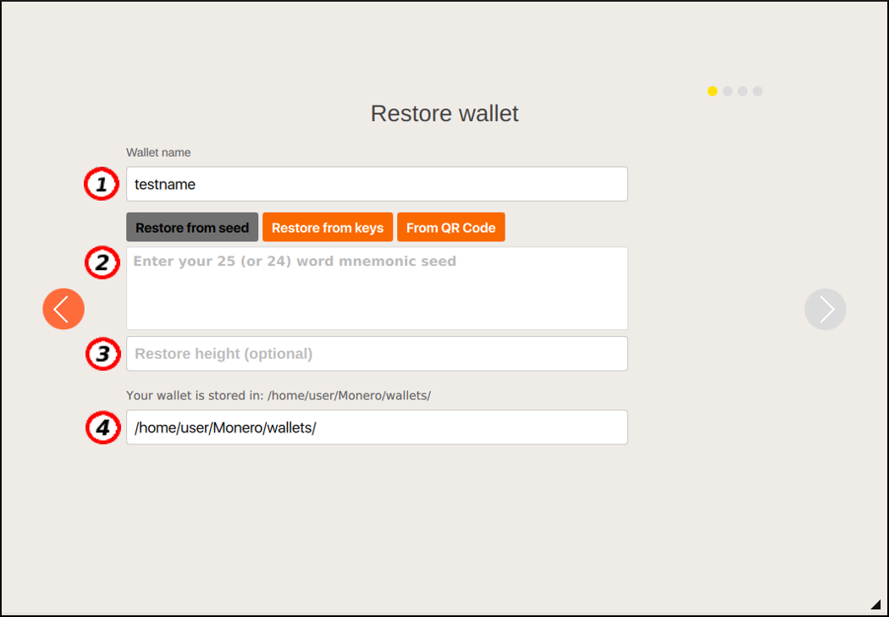

Restoring from your mnemonic seed is the easiest way to recover your
wallet. You need to put the following information:

(1) **Wallet name:** Give a name for your wallet (in this example
    `testname` is used).\
(2) **Mnemonic seed:** Paste your seed made of 25 (or 24) words.\
(3) **Creation Date or Restore height (optional):** If you know the date
    or block height that your wallet was created at, you can specify it
    here so the wallet doesn't have to scan the entire blockchain
    looking for your funds. For example, if your first transaction was
    included on `2017-07-08` in block `1350000`, you should put the
    previous day date (e.g. `2017-07-06`) or a slightly lower height
    (e.g. `1330000`) so the wallet will start scanning from there,
    saving you some time. More information about restore height on
    [StackExchange](https://monero.stackexchange.com/questions/7581/what-is-the-relevance-of-the-restore-height).\
(4) **Wallet location:** Select the destination folder of the wallet.

A detailed guide is available on getmonero.org: ['How to restore your
account'](https://getmonero.org/resources/user-guides/restore_account.html)

### Restoring from keys

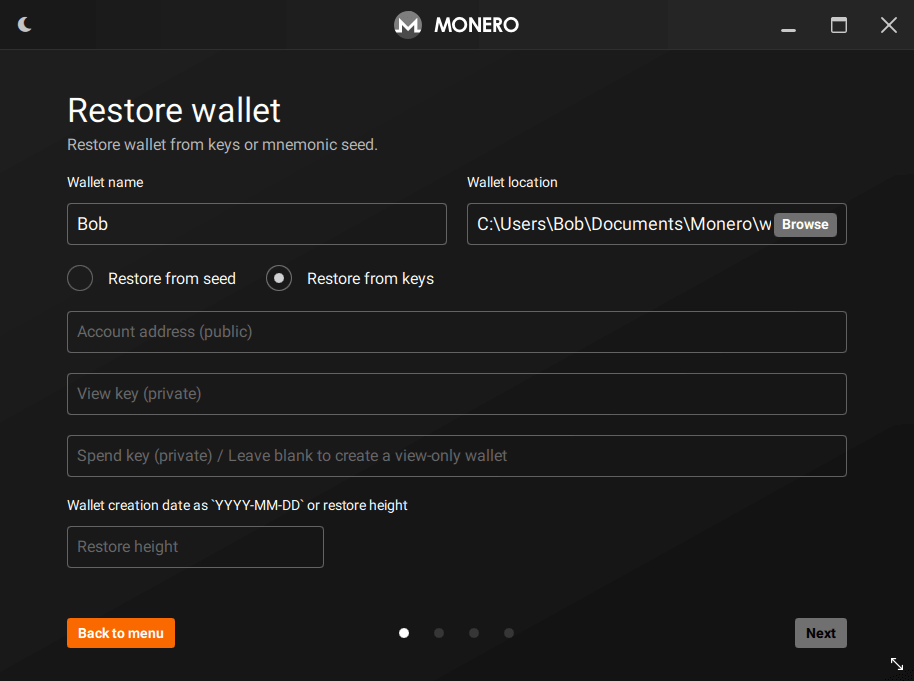

Restoring from keys is quite easy and can be extremely useful,
especially if you are moving your wallet from an online service like
MyMonero. You need to put the following information:

(1) **Wallet name:** Give a name for your wallet (in this example
    `testname` is used).\
(2) **Account address:** The address of the wallet you are recovering.\
(3) **View key:** Your private view key (needed to be able to check your
    funds).\
(4) **Spend key:** Your private spend key (needed to spend your funds).\
(5) **Creation Date or Restore height (optional):** If you know the date
    or block height that your wallet was created at, you can specify it
    here so the wallet doesn't have to scan the entire blockchain
    looking for your funds. For example, if your first transaction was
    included on `2017-07-08` in block `1350000`, you should put the
    previous day date (e.g. `2017-07-06`) or a slightly lower height
    (e.g. `1330000`) so the wallet will start scanning from there,
    saving you some time. More information about restore height on
    [StackExchange](https://monero.stackexchange.com/questions/7581/what-is-the-relevance-of-the-restore-height).\
(6) **Wallet location:** Select the destination folder of the wallet.

When everything is ready click the right arrow and then the `Use Monero`
button.\
A detailed guide is available on getmonero.org: ['Restoring wallet from
keys'](https://getmonero.org/resources/user-guides/restore_from_keys.html)

Open a wallet from file
-----------------------

After clicking this option a window will pop up. Navigate to your file
with the extension `.keys`, select it and click the right arrow.

Synchronization
===============

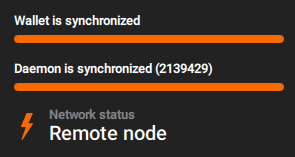

After creating and opening a wallet file, Monero GUI will start
synchronizing. This process is required to know your balance, receive
and send transactions.

Monero GUI's synchronization is composed of two parts: 1) Daemon
synchronization 2) Wallet synchronization

Daemon synchronization
----------------------

Monero GUI wallet uses a daemon (monerod), which is a program running in
the background that synchronizes with the Monero network to scan for
incoming transactions and to send new transactions.

Your daemon must have access to the Monero blockchain, which is a very
large file (more than 100 GB) which contains all transactions that have
been made since the beginning of Monero in 2014. The blockchain file can
be stored in your computer (if your daemon run a local node) or in a
computer of another person (if your daemon connect to a third-party
remote node). If you decide to run a local node, you can run it as a
full node, that has the whole blockchain file (more than 100 GB) or as a
prunned node, that has a light version of the blockchain file (1/3 of
the size, aproximatedly 35 GB).

The best way to contribute to Monero's security and decentralization is
running a local node as a full node. Even though local nodes running as
pruned nodes also contribute to Monero's security and decentralization,
they are still less comprehensive than full nodes. However, pruned nodes
are better for your privacy and to the Monero network than connecting to
someone else's remote node.

### Daemon synchronization with local node

If you run a local node as a full node (requires wallet in "advanced
mode" with local node selected in Setings \> Node), your wallet daemon
will download the blockchain file into your computer. Since it's a very
large file (more than 100 GB), this can take a long time, even days,
depending on your internet speed and storage unit (HDD or SSD).

If you run a local node as a full node with a bootstrap node (requires
wallet in "simple mode (bootstrap)"), your wallet daemon will also
download the blockchain file into your computer, but it will connect to
a remote node (a bootstrap node) while the download is not finished,
allowing you to immediately send/receive a transaction.

If you want to run a local node as a pruned node, see [this
guide](https://monero.stackexchange.com/questions/11454/how-do-i-utilize-blockchain-pruning-in-the-gui-monero-wallet-gui).

### Daemon synchronization with remote node

If you want to connect to a remote node (requires wallet in "simple
mode" or in "advanced mode" with remote node selected in Settings \>
Node), your daemon will use the blockchain of a third party remote note.
Since it will not have to download the whole blockchain file, your
synchronization will be faster.

### Block height

After your daemon and your wallet are synchronized, your daemon progress
bar will display "Daemon is synchronized (number)", see below:

This number between parenthesis is the current block height, which is
the latest block received by your daemon. In average, this number wil
increase +1 every 2 minutes, when a new block is found by a miner.

Wallet synchronization
----------------------

After synchronizing the daemon, your wallet will scan the blockchain
file, searching for past transactions. Once a previous transaction is
detected and retrieved by your wallet, your balance and your transaction
history will be updated.

Since all transactions are encrypted in Monero, your wallet will have to
decrypt a lot of transactions. This process places very high demands on
your computer's resources, including CPU processing and many readings
and writings in your hard disk. Depending on your system configuration,
this can take a long time, even days, so please be patient. Be aware
that the synchronization speed is not always constant. Some blocks can
have more transactions and/or use different technologies, therefore they
may take longer to verify.

### Wallet restore height

The wallet restore height is the block number (block height) where your
wallet will start searching for transactions. This number should be a
block height before the block that included your first incoming
transaction. For example, if your wallet received Monero for the first
time in 2020-09-20, your wallet restore height must be a block number
before the block height of this date. Monero wallets usually ask you to
write down your wallet restore height together with your restore seed
when you are creating a wallet. You should never set your wallet restore
height to 0, otherwise your wallet will scan all transactions in the
whole blockchain (since 2014), which takes a lot of time.

### How to change Wallet restore height / Wrong or zero balance after synchronizing

In order to see the correct balance, your wallet must be fully
synchronized AND using a correct restore height. If your wallet is fully
synchronized but your balance is still wrong, you're probably using a
wallet restore height that is higher than the block height of your first
incoming transaction. To solve this, you have to set a new wallet
restore height. Go to Settings \> Info page, Wallet restore height and
click on "(Change)".

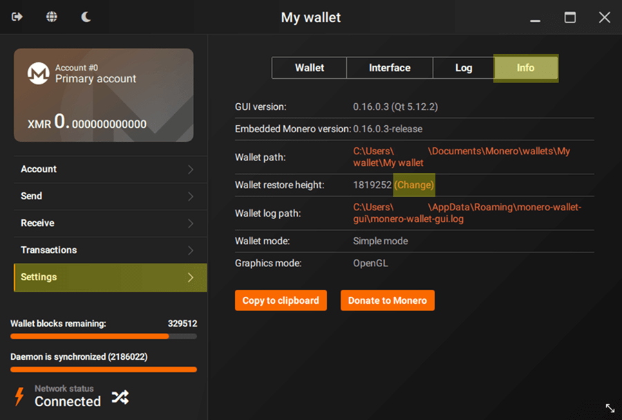

Next, enter a new restore height or an estimate date before your first
incoming transaction, and then click on "Ok".

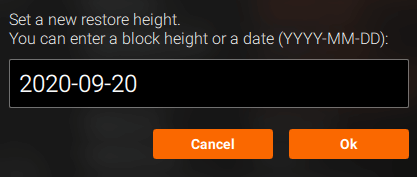

Your wallet will now rescan the blockchain starting from the new restore
height.

### How to speed up wallet initial synchronization

Some factors that can increase the speed of your initial synchronization
are: \* Broadband internet connection \* Using a SSD (solid state disk
drive) instead of an HDD (hard disk drive) \* Having a faster CPU \*
Connecting to a remote node will avoid downloading the blockchain.

Monero Account
==============

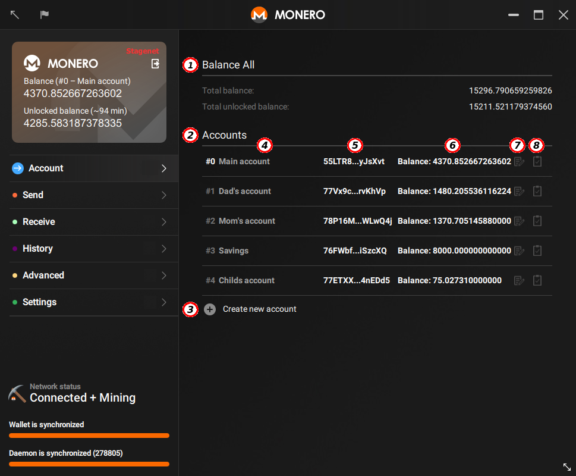

The `Account` tab provides tool to handle your different Monero accounts
within your wallet. Each wallet can have multiple accounts, and each
account has its own balance. Also, each account can have multiple
subaddresses associated with it. For convenience sake, the account
address is considered the first address (or subaddress) generated for an
account. Since accounts and subaddresses are deterministically derived
from the mnemonic seed, you only need to know the seed in order to
restore the account/subaddress structure when restoring a wallet
(although any labels you assign to the accounts/subaddresses will need
to be added again, since they are stored in your wallet file, and not in
your mnemonic seed, neither on the blockchain).

(1) **Balance All:** Let you see the sum of all your accounts balances,
    unlocked or not.\
(2) **Accounts:** This is the list of all accounts already generated on
    your wallet and their corresponding account addresses.\
(3) **Create new account:** Click on this button to create a new account
    and set its *optional* label.

You can change the current account by simply clicking on it on the
list.\
Each of your accounts are filled with their own informations:

(4) **Label:** A name or description of the account for convenience.\
(5) **Account Address:** This is the public address you should give to
    the sender when you want to receive money in this account. In
    account \#0, it starts with 4 and corresponds to the wallet's
    primary address. In the remaining accounts it corresponds to the
    account's first subaddress and therefore starts with 8.\
(6) **Balance:** The account total balance. It cumulates the main
    address and all subaddresses for this account. *Note: Subaddresses
    are managed in the [Receive](#receive-monero) screen*\
(7) **Edit Label:** Click on this button to edit this account label.\
(8) **Copy Address to Clipboard:** Click on this button to copy this
    account address to the clipboard.

Send Monero
===========

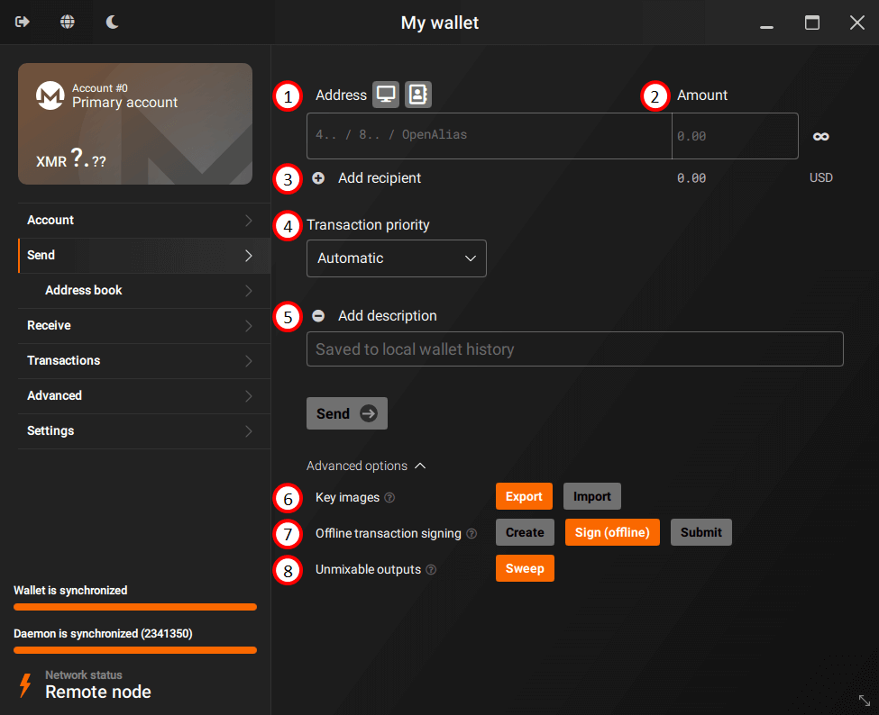

The `Send` tab provides tools for creating outgoing transactions.

(1) **Address:** This is where you enter the destination address of the
    transaction. You can either enter a Monero address (a primary
    address starting with 4... or a subadress starting with 8...) or an
    OpenAlias address (see [this
    page](https://www.getmonero.org/resources/moneropedia/openalias.html)
    for more information about OpenAlias). Best practice is to copy and
    paste the address to prevent errors. Since there are malwares that
    may replace the address of your clipboard with an address associated
    with hackers, you should always verify the destination address after
    pasting it. Click on the *Address book* button on the right side to
    import an address from the address book of your wallet.\
(2) **Amount:** This is how much Monero (XMR) you want to send. Click on
    the *All* button on the right side to create a transaction spending
    all the spendable (unlocked) balance available in your selected
    account. If you have enabled the option to display the balance in
    other currencies in Settings \> Interface, your wallet will also
    display the amount converted in fiat currency.\
(3) **Transaction priority (requires wallet in advanced mode):** This is
    the priority level your transaction will receive in the pool of
    transactions waiting to be confirmed. The higher the transaction
    priority, the faster your transaction will be confirmed (included in
    a block), but the higher you will pay in transaction fee.\
    *Currently staying with the default or the slow option is likely to
    get you into the next block.*\
(4) **Description (optional):** Here you can add some information
    regarding your transaction for future reference. This function is
    for your record keeping only. The description text will be stored in
    your wallet file and only you will be able to see it. It will not be
    be sent to the receiver, nor stored on the blockchain.

**Advanced options** (requires wallet in advanced mode)

(5) **Key images:** This section allows you to export the key images
    from your cold wallet into a file, as well as to import this key
    images file into your view-only wallet. When your view-only wallet
    has the key images for all outputs, it can display the true balance.
    In order to import the key images into your view-only wallet, you
    must use a local node or be connected to a trusted remote node (you
    can set a trusted remote node in "Settings" \> "Node" page). Click
    on the question mark icon to see step-by-step instructions.\
(6) **Offline transaction signing:** This feature refers to the practice
    of keeping the private keys in a cold wallet, which is a wallet
    installed in an offline ("cold") device. Since the offline wallet
    never gets connected to the internet, its stored private keys remain
    secure. The cold wallet is only used to sign individual
    transactions, which are later sent to the Monero network using a
    view-only wallet. Click on the question mark icon to see
    step-by-step instructions.\
(7) **Sweep unmixable:** This allows you to get rid of outputs which
    have strange amounts like `0.000006839355` and can't be spent
    without combining them with another output.\
    *Most users will never need to use this feature.*

Address Book
------------

The `Address book` tab lets you save the name and Monero address of
contacts that you frequently transact with. This is a convenient place
to copy addresses from when creating transactions.

Receive Monero
==============

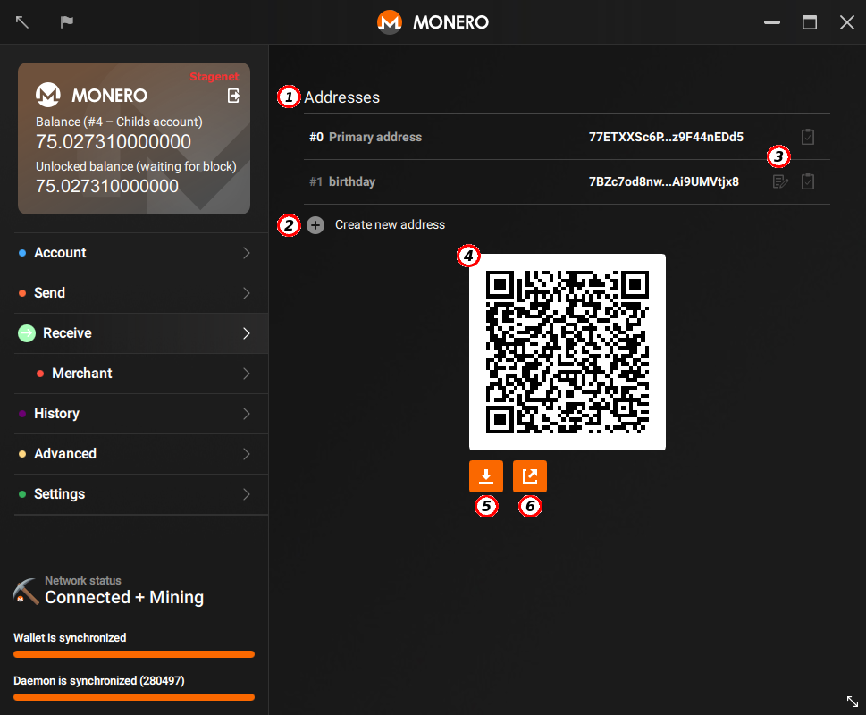

The `Receive` tab provides tools for generating subaddresses.

(1) **Addresses:** This list includes your wallet's primary address
    (starting with 4...) and all its subaddresses (starting with 8...).\
(2) **Create new address:** This button allows you to create as many new
    subaddresses as you wish. Since Monero is private, you don't need to
    create a new subaddress every time you receive a transaction.
    However, to avoid off-chain linking, it's recommended that you
    create a new subaddress for every person, company or exchange you
    will receive Monero from. *Learn more about
    [subaddresses](https://monero.stackexchange.com/questions/3673/what-is-a-sub-address).*\
(3) **Set Label:** Click on this button to set this subaddress label.
    You can use this label to store the person, company or exchange you
    gave this subaddress.\
(4) **QR code:** This is a QR code that has your selected address
    embedded into it. It can be used as a way to give others your Monero
    address by scanning the code.\
(5) **Save:** Click here to save the QR code as a `png` image.\
(6) **Copy:** Click here to copy the QR code corresponding URL formated
    as \*monero:
    <address>

    -   

Merchant mode
-------------

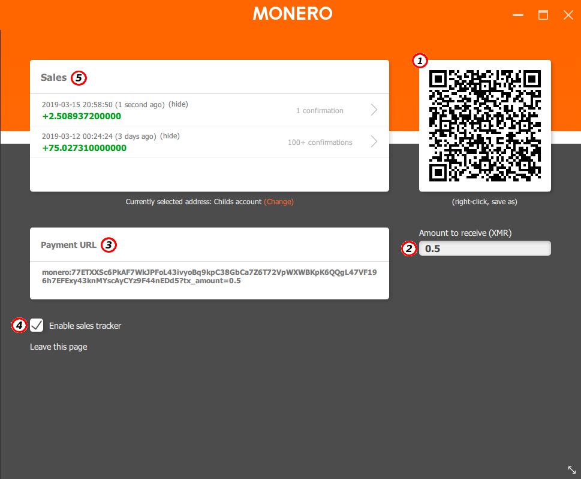

The `Merchant` mode offers vendors a simple Point of Sale (PoS) to
receive Monero (XMR). It allows you to manually generate payment
requests, and to monitor incoming transactions (unconfirmed and
confirmed transactions).

(1) **QR code:** This is a QR code that contains your currently selected
    address, and, optionally, the amount to receive. Display this QR
    code to your customers, so they can scan it and pay using their
    mobile wallets.\
(2) **Amount to receive (XMR):** This is used to create a payment
    request. Enter the amount of Monero (XMR) you would like to receive,
    and the QR code will be updated.\
(3) **Payment URL:** This is the URL corresponding to the address and
    amount you have chosen. It could be copied by clicking on it and
    sent to a customer.\
(4) **Enable sales tracker:** If you tick this box, you'll see a list of
    incoming transactions. By enabling sales tracker, the merchant page
    will automatically scan the blockchain and the tx pool for incoming
    transactions using the QR code. It's up to you whether to accept
    unconfirmed transactions or not. It is likely they'll be confirmed
    in short order, but there is still a possibility they might not, so
    for larger values you may want to wait for one or more
    confirmation(s).\
(5) **Sales:** Those are the transactions currently seen on the
    blockchain and the transaction pool, with associated confirmations.

Transactions History
====================

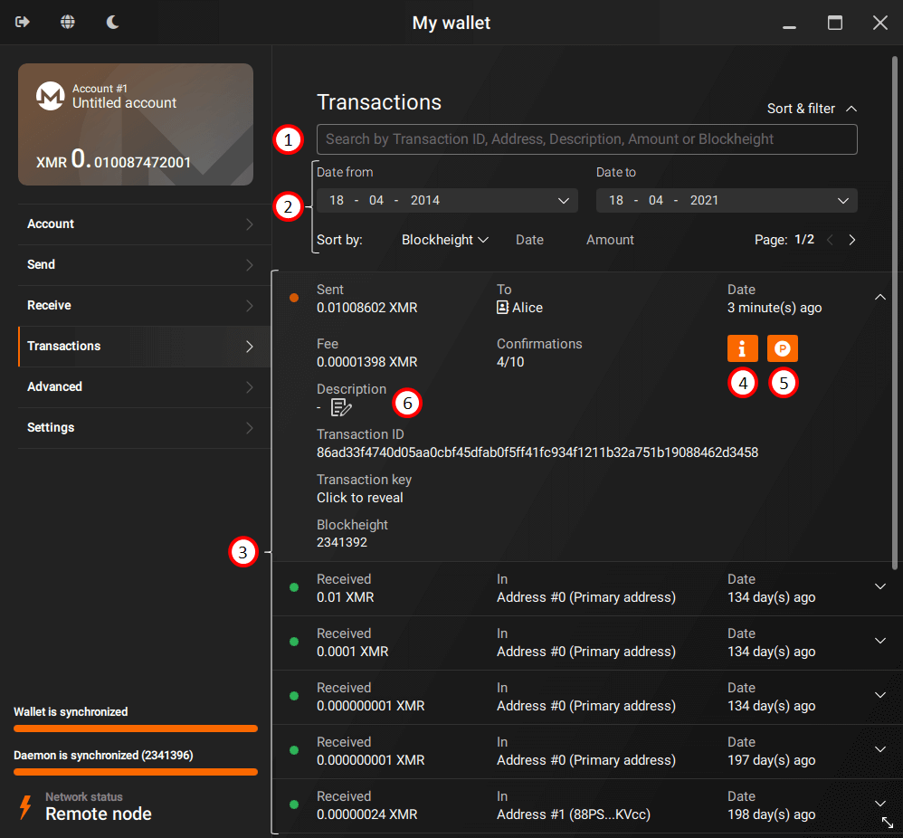

The `Transactions` tab let you walk through the transactions sent and
received on the currently selected account of your Monero wallet.

(1) **Search:** Quickly filter out transactions from the list searching
    by transaction ID, destination address, description, amount or
    blockheight (number of the block in which the transaction was
    mined).\
(2) **Sort & Filter:** Here you can filter out transactions between
    specific dates, or sort them by blockheight, date or amount.\
(3) **Transaction list:** This area displays the sent and received
    transactions of the currently selected account. Each transaction is
    displayed with the following information: `Amount`, `Blockheight`,
    `Date`, `Fee` (for outgoing transactions), `Confirmations`,
    `Description` (optional), `Transaction ID`, `Transaction key`, and
    `Destination address`. The transaction ID, the transaction key and
    the destination address can be used to prove that a payment was done
    in case of a dispute. The transaction keys and the descriptions
    (notes) are stored in the cache of your local wallet, therefore they
    cannot be recovered from the blockchain.\
(4) **Details:** Clicking here will show you the following transaction
    details, when available: `Transaction ID`, `Date`, `Amount`,
    `Address`, `Payment ID`, `Integrated address`, `Transaction key`,
    `Description (note)`, `Destinations` and `Rings`.\
(5) **Prove payment (P):** Clicking here will generate a payment proof,
    which you can use, in case of a dispute, to prove that you made a
    payment. More details on proving payments can be found
    [here](https://getmonero.org/resources/user-guides/prove-payment.html)\
(6) **Set description:** Click on this icon to set a new description or
    edit an existing one.\
(7) **Advanced options:** Lets you choose in which format the date
    should be displayed.

Advanced Features
=================

Solo mining
-----------

The Mining tab provides a one click CPU miner that is embedded into the
GUI.

(1) **CPU threads:** Number of CPU threads to use for mining.\
(2) **threads auto-configuration:** Set automatically the number of
    threads either to the recommended number, or to the max number.\
(3) **Background mining:** Check this box to enable experimental
    background mining. This should allow you to use your computer
    normally while mining.\
(4) **Start mining:** Start the miner.\
(5) **Stop mining:** Stop the miner.\
(6) **Status:** Indicates the mining state and hashrate.

Prove - Check
-------------

The `Prove/check` tab provides tools for proving a payment or validating
proof of a payment. This is necessary with Monero because these details
are not available on the blockchain.

### Prove Transaction

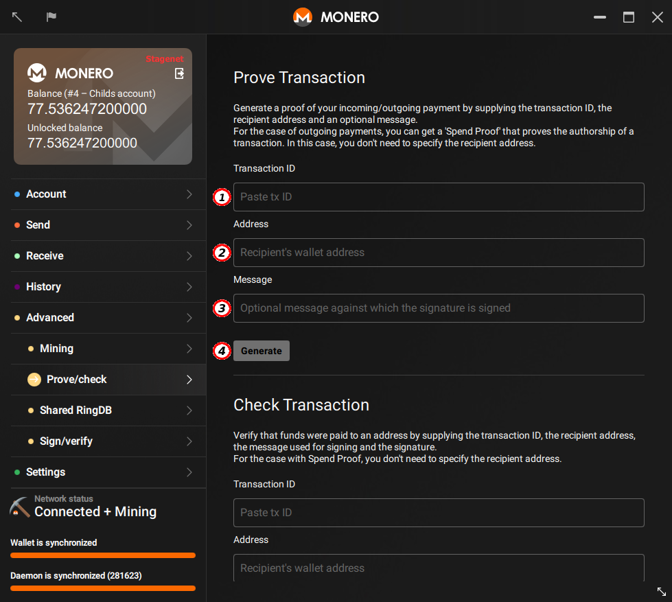

This will generate a proof that you made a payment to a certain address.
You need to put the following information:

(1) **Transaction ID:** This is the ID of the payment you are creating
    proof for. You can find the transaction details by selecting the
    History tab from the left menu.\
(2) **Address:** This is the address you are proving payment to.\
(3) **Message (optional):** This an optional message that will be signed
    with the transaction details. If you choose to include a message
    then the other party must also include the exact same message in
    order to verify your proof.\
(4) **Generate:** Click here once you've entered all the details to
    generate your proof.  

A detailed guide is available on getmonero.org: ['How to prove
payment'](https://getmonero.org/resources/user-guides/prove-payment.html)

### Check Transaction

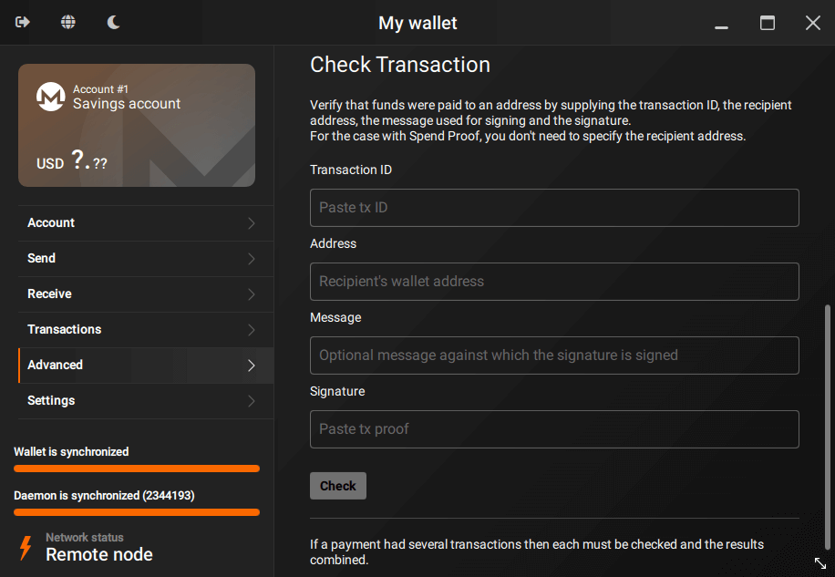

This will verify that a payment was made. You need to put the following
information:

(1) **Transaction ID:** This is the ID of the payment you are attempting
    to verify.\
(2) **Address:** This is the receiving address of the payment you are
    attempting to verify.\
(3) **Message (optional):** This is the optional message that may have
    been included with the proof.\
(4) **Signature:** This is the signature generated to prove payment.\
(5) **Check:** Click here once you've entered all the details to check
    that the transaction proof is valid.

Shared RingDB
-------------

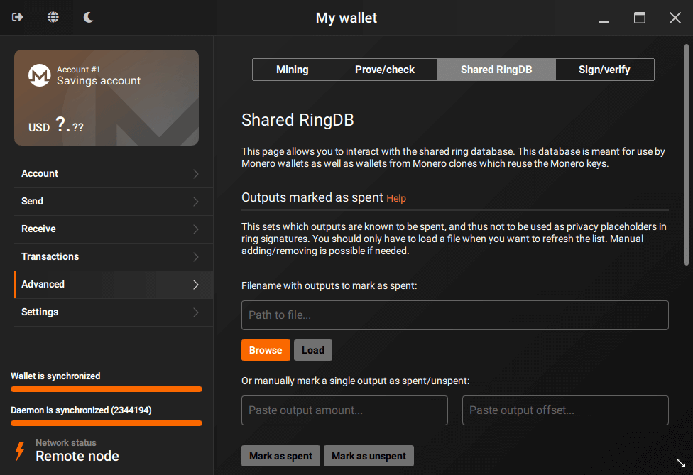

This is an advanced tool that can be used to improve the privacy of ring
signatures. The outputs used in ring signatures can be adapted to
mitigate the privacy loss when using a key-reusing fork or to avoid
outputs that could not be spent in this transaction.

(1) **Mark as spent filename:** This tool will mark outputs that are
    known to be spent. After running
    monero-blockchain-mark-spent-outputs, import the resulting file to
    avoid using these outputs as decoys in constructed ring signatures.
    This file is stored in the .shared-ringdb folder by default.\
(2) **Mark as spent output:** This will mark or unmark as spent a chosen
    single output. Outputs are represented by 64-character strings. The
    outputs added in this field will not be used as decoys in
    constructed ring signatures. Unmarked outputs may (but will not
    necessarily) by used as decoys.

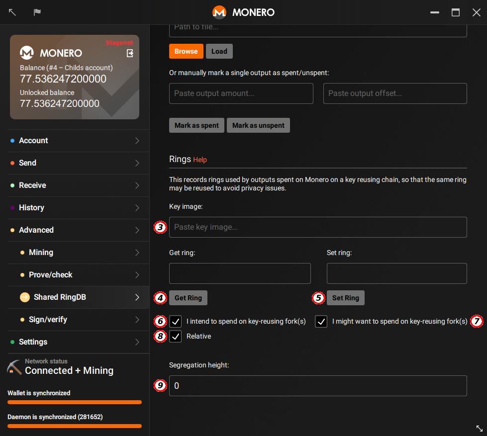

(3) **Key image input:** Add the key image that was used on the
    key-reusing fork.\
(4) **Get ring:** Press the "Get Ring" button to get the ring members
    for the given key image in 3.\
(5) **Set ring:** Press the "Set Ring" button to set the ring members
    for a transaction. Copy the ring members from 4 to get those for the
    key image, or manually type in your own.\
(6) **Intent to spend:** Select this if you are certain that you will
    spend Monero on a key-reusing fork. This will aggressively modify
    the input selection algorithm to give you the greatest plausible
    deniability.\
(7) **Possibility to spend:** Select this if you may spend Monero on a
    key-reusing fork. This will modify the input selection algorithm.
    Uncheck this only if you are certain you will not use a key-reusing
    fork.\
(8) **Relative:** When selected, the offsets are encoded relative to the
    previous, as opposed to absolute (transactions use relative
    offsets).\
(9) **Segregation height:** The block height at which the key-reusing
    fork splits.

Sign - verify Message
---------------------

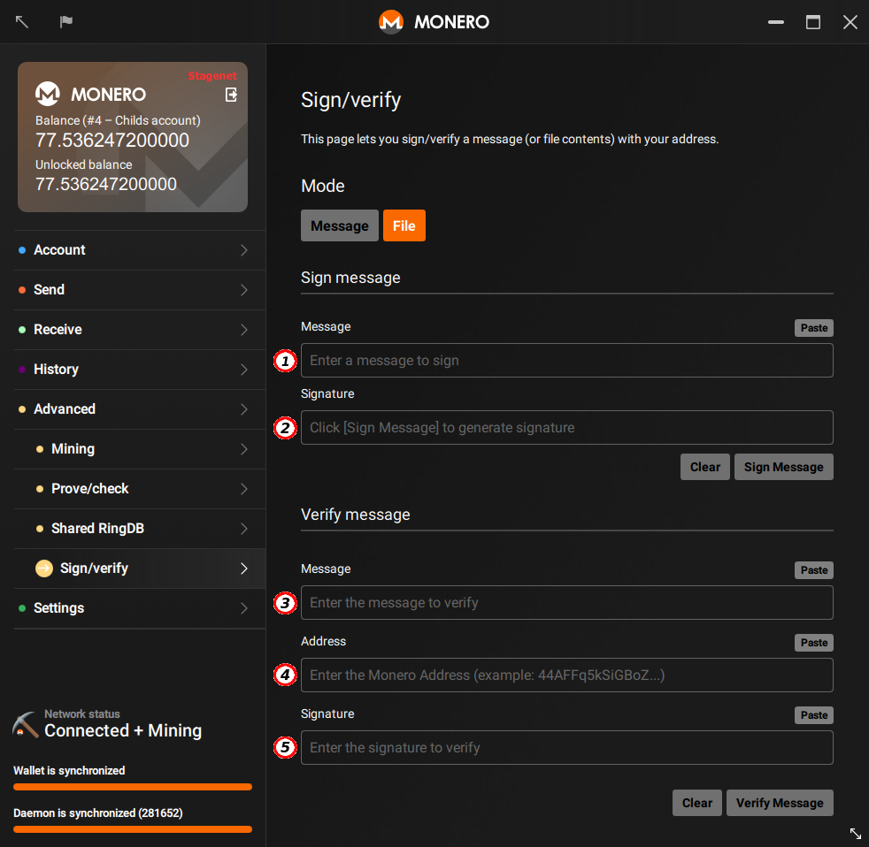

The `Sign/verify` tab provides tools for signing a message or file with
your private key or verifying the authenticity of a singed message or
file.

### Sign

(1) **Message:** This is where you can enter a message to be signed.\
(2) **Signature:** This is where your unique signature will appear once
    you click the Sign button. This is linked to your private key and
    the message you entered. It will be given as proof along with the
    message which was signed.

### Verify

(3) **Verify message:** This is where you will put a message that has
    been signed.\
(4) **Address:** This is where you will enter the public Monero address
    of the signer.\
(5) **Signature:** This is where you will enter the signature you are
    verifying. Once all the required information has been entered click
    the Verify button. A pop-up will tell you if the signature is valid.

Sign - verify File
------------------

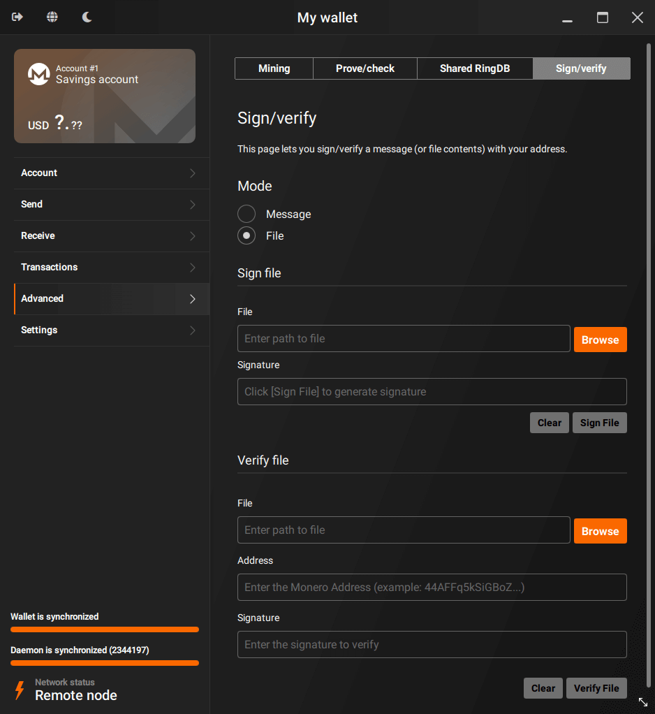

The `Sign/verify` tab provides tools for signing a message or file with
your private key or verifying the authenticity of a singed message or
file.

### Sign

(1) **File:** This is where you can choose a file to be signed. Click
    Browse to navigate the file system.\
(2) **Signature:** This is where your unique signature will appear once
    you click the Sign button. This is linked to your private key and
    the file you entered. It will be given as proof along with the file
    which was signed.

### Verify

(3) **File:** This is where you enter the path to a file that has been
    signed. Click Browse to navigate the file system.\
(4) **Address:** This is where you will enter the public Monero address
    of the signer.\
(5) **Signature:** This is where you will enter the signature you are
    verifying. Once all the required information has been entered click
    the Verify button. A pop-up will tell you if the signature is valid.

Settings
========

The `Settings` tab provides tools for customizing configuration options.

### Wallet

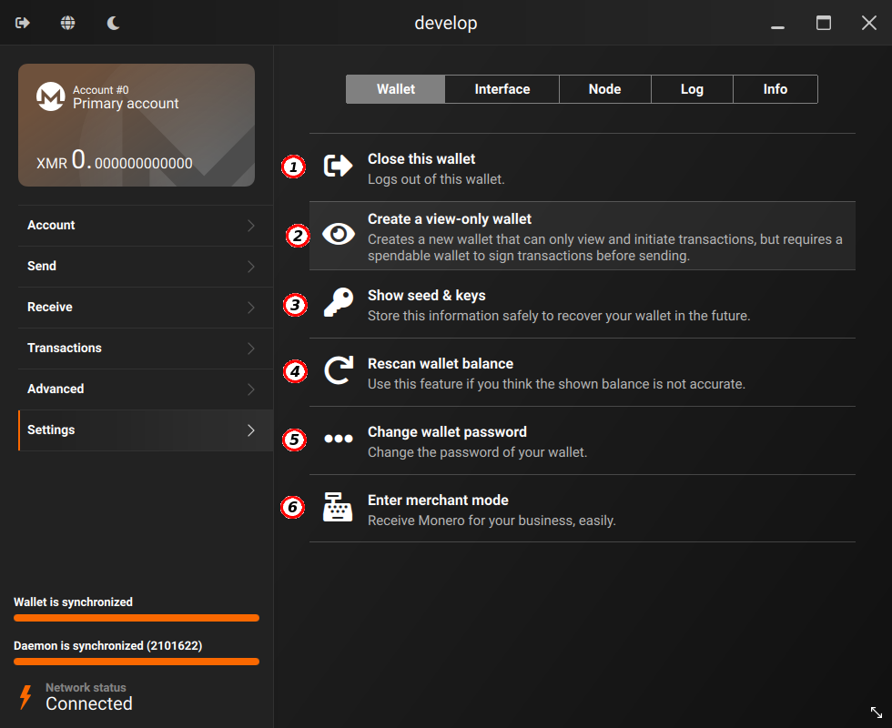

(1) **Close this wallet:** Click here to safely close the current wallet
    and open the main menu.\
(2) **Create a view-only wallet:** Click here to generate a view-only
    (or audit) wallet file, which is capable to see all incoming
    transactions. In order to display the real balance, you must also
    import the key images from your normal wallet into your view-only
    wallet. The view-only wallet will be created with the same password
    as the current wallet. See this
    [user-guide](https://getmonero.org/resources/user-guides/view_only.html)
    for more information.\
(3) **Show seed & keys:** This button will redirect you to the [Seed and
    keys](#seed-and-keys) tab.\
(4) **Rescan wallet balance:** Click here to rescan all spent outputs
    from your wallet, updating your wallet balance. If your balance is
    still incorrect, you probably will have to resync your wallet after
    changing the wallet restore height to a restore height before the
    height of the first transaction to your wallet. To do this, go to
    the Settings \> Info page, Wallet restore height, and click on the
    (Change) link.\
(5) **Change wallet password:** Click here to change the password of
    your wallet file.\
(6) **Enter merchant mode:** Click here to open Monero GUI's
    business-friendly mode.

### Interface

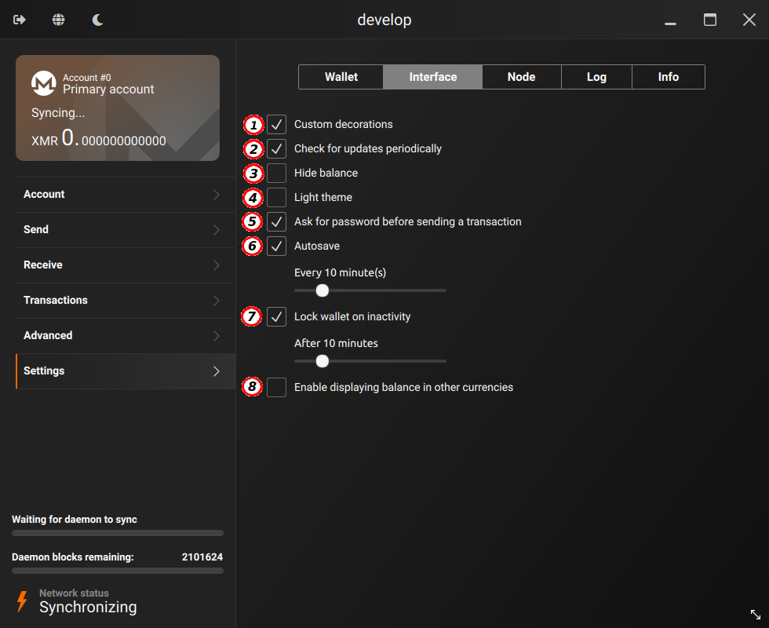

The `Interface` tab is where you can adjust appearance and security
settings of the GUI wallet. The options are:

(1) **Custom decorations:** Switch custom window decorations.\
(2) **Check for updates periodically:** Enable this option if you want
    your wallet to periodically check if a new version is available.\
(3) **Hide balance:** Will display your balance as ?.?? in the balance
    card. It is a useful privacy feature if you are running your wallet
    in a public place, as a point of sales system, or if you have to
    take a screenshot or record your screen to someone.\
(4) **Light theme:** Switch between light and dark themes.\
(5) **Ask for password before sending a transaction:** Disable this
    option if you don't want to type your password every time a
    transaction is sent. This option is enabled by default.\
(6) **Autosave:** When enabled, your wallet file will be saved
    automatically, every 10 minutes (default) or at an interval of your
    choice. This option is enabled by default.\
(7) **Lock wallet on inactivity:** Set this to automatically lock your
    wallet after N minutes of inactivity. This ensures no one is able to
    use your wallet while you are away from keyboard.\
(8) **Enable displaying balance in other currencies:** Gives you the
    possibility to also display your balance, the transaction amount and
    transaction fee in other currencies. You can select the price source
    and the currency you prefer (currently only *USD* and *EUR* are
    supported).

### Local Node

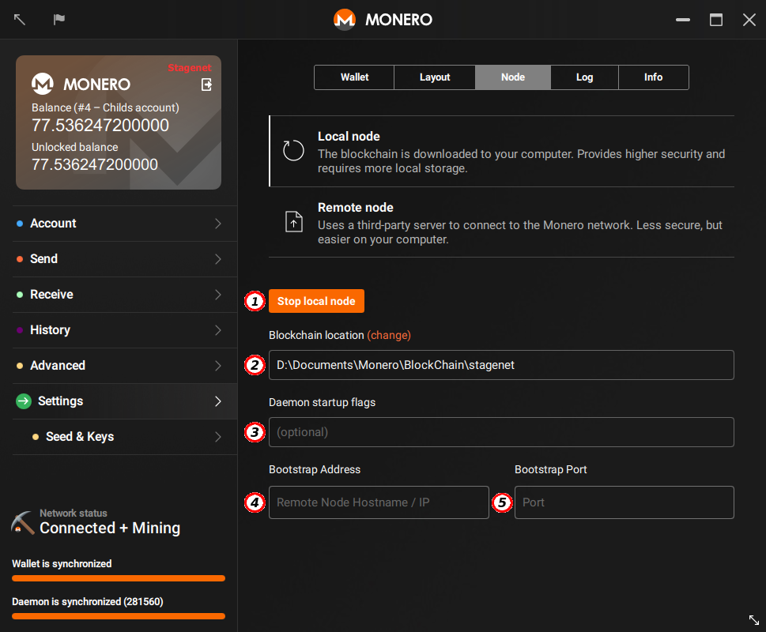

(1) **Start/Stop Local Node:** Depending on its current state, either
    start or stop the local node.\
(2) **Blockchain location:** Manually enter a non-default path to the
    blockchain, or click `change` to choose a new path.\
(3) **Startup flags:** When using a local node, this will be where you
    enter additional command line options.\
(4) **Bootstrap Address:** Enter the hostname or IP address of the
    bootstrap remote node. See section [Bootstrap
    nodes](#bootstrap-nodes) for a brief explanation of what a bootstrap
    node is.\
(5) **Bootstrap Port:** Enter the port of the bootstrap remote node.

### Remote Node

Use a remote node, do not download the blockchain. Check the ['About
remote nodes' section](#about-remote-nodes) of this guide.

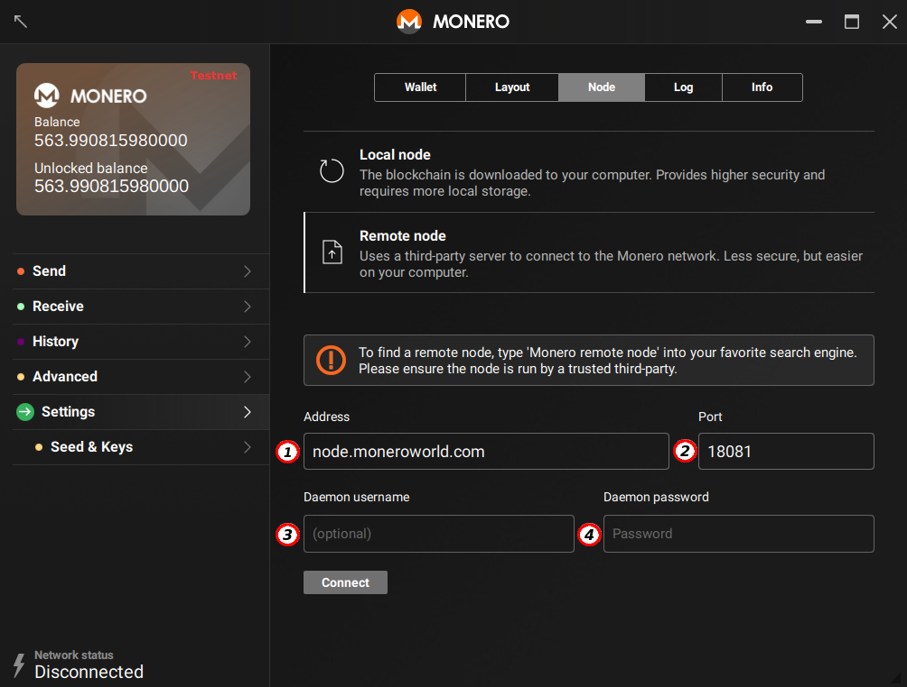

(1) **Address:** Enter the hostname or IP address of the remote node.\
(2) **Port:** Enter the port of the remote node.\
(3) **Daemon Username:** Enter a username in case authentication to the
    remote node is required.\
(4) **Daemon Password:** Enter a password in case authentication to the
    remote node is required.\
(5) **Trusted Daemon:** By default, data requests to remote nodes are
    obfuscated, and this process requires more resources. If your remote
    node is under your control (i.e. a dedicated server of your own) you
    can mark it trusted so that data requests will not be obfuscated
    anymore (just like a local node).

### Log

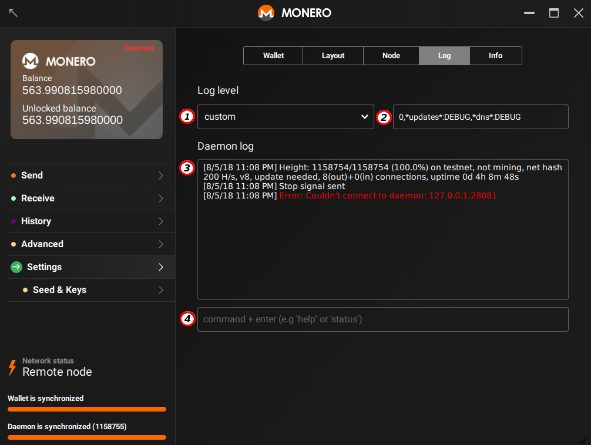

(1) **Log level:** Change the verbosity of the debug logs.\
(2) **Log categories:** Add specific categories to the debug logs.\
(3) **Daemon log:** Real time output of the log.\
(4) **Command line:** Interact with the daemon.

### Info

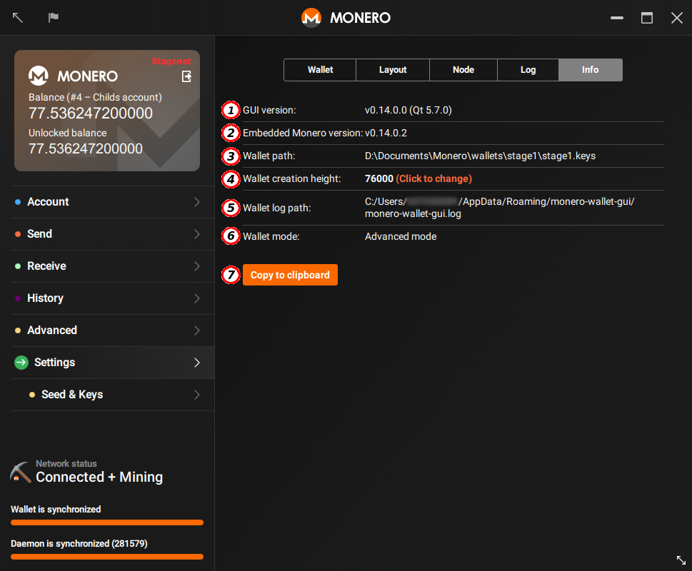

(1) **GUI Version:** Version of the GUI wallet installed.\
(2) **Embedded Monero Version:** Version of the embedded daemon in use.\
(3) **Wallet path:** Where the wallet is located on your computer.\
(4) **Wallet restore height:** Your wallet synchronization starts at the
    block defined in wallet restore height. Therefore, you must set the
    restore height before the height of the first incoming transaction
    of your wallet. If you click on the (Change) link, you can set a
    blockheight or a date. After changing it, your wallet will rescan
    the blockchain starting from the blockheight you set. *Note: when
    you change your wallet's restore height, you will lose all
    information that is stored in the wallet software and cannot be
    recovered from the blockchain, which includes destination addresses,
    transaction keys, and descriptions (notes).*\
(5) **Wallet log path:** Where the logs for this wallet will be saved.\
(6) **Wallet mode:** Display the wallet mode chosen in the
    [wizard](#choose-wallet-mode).\
(7) **Graphics mode:** Display the graphics mode.\
(8) **Copy to clipboard:** Copy all information to clipboard.

Seed and keys
-------------

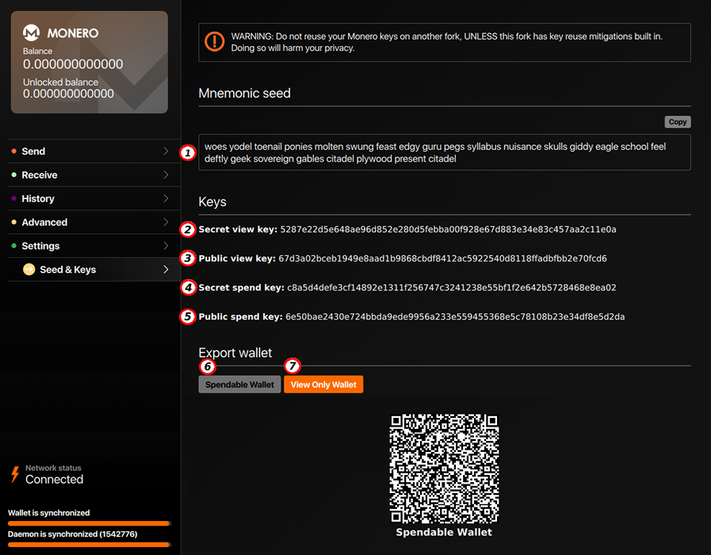

The `Seeds & Keys` tab displays your wallets mnemonic seed as well as
your secret view key, public view key, secret spend key, and public
spend key.

(1) **Mnemonic seed: DO NOT share your mnemonic seed with anyone. Store
    a copy securely.** The mnemonic seed is a 25 word phrase that
    contains all the information needed to view and spend funds. *Learn
    more about [mnemonic
    seeds](https://getmonero.org/resources/moneropedia/mnemonicseed.html).*\
(2) **Wallet restore height.** This is the blockheight of the first
    incoming transaction of your wallet. This information is useful when
    you restore your wallet, because you will only have to synchronize
    the blockchain for the period that is needed.\
(3) **Primary address:** This is the main address of your wallet and
    starts with 4. All other addresses from your wallet are
    subaddresses, and start with 8.\
(4) **Secret view key:** Secret (private) view keys allows the holder to
    view your wallets incoming transactions, but not outgoing. It is
    sometimes useful for auditing purposes to give your secret view key
    to a third party.

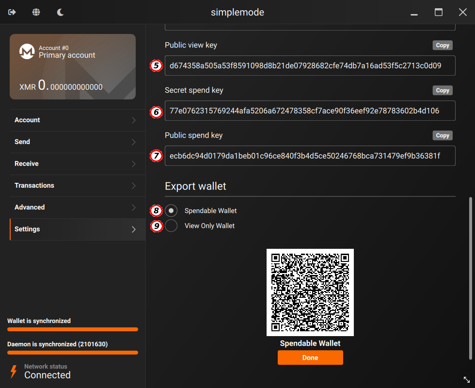

(5) **Public view key:** The public view key is used for stealth address
    creation. *Learn more about [view
    keys](https://getmonero.org/resources/moneropedia/viewkey.html).*\
(6) **Secret spend key: DO NOT share your secret spend key with anyone.
    The secret (private) spend key is used to sign transactions and
    should be regarded with the same security as your mnemonic seed.**\
(7) **Public spend key:** The public spend key is used by the network to
    verify the signature of the key image you generate when you make a
    transaction. This is what prevents double-spends as the network
    enforces the rule that a key image can be spent only once. *Learn
    more about [spend
    keys](https://getmonero.org/resources/moneropedia/spendkey.html).*\
(8) **Export Spendable Wallet: DO NOT share your spendable wallet QR
    code with anyone. This can be used like a mnemonic seed for
    recovering your wallet.** This creates a qrcode that contains all of
    your keys.\
(9) **Export View Only Wallet:** This creates a QR code that contains
    only the keys for viewing the transactions that this wallet sends or
    receives, but cannot create transactions.

Binaries Verification
=====================

Verify that the files you downloaded match the official ones. You can
use [this step-by-step
guide](https://getmonero.org/resources/user-guides/verification-windows-beginner.html)
with pictures (easy, for Windows user).

About remote nodes
==================

Remote nodes are useful if you are not able/don't want to download the
whole blockchain, but be advised that malicious remote nodes could
compromise some privacy. They may track your IP address, track your
"restore height" and associated block request data, and send you
inaccurate information to learn more about transactions you make. Please
make sure to use a node you trust (hopefully your own) and remain aware
of these limitations. Users who prioritize privacy should use the wallet
in advanced mode and start a local node without setting a bootstrap
node. A number of public remode nodes are listed at
[moneroworld.com](https://moneroworld.com) and
[node-o-matic](https://node.pwned.systems)

Bootstrap nodes
---------------

Remote nodes can also be useful if you are running a local node and want
to use Monero before the blockchain download has finished. In this
situation, the remote node is known as a bootstrap node. Your local node
will temporarily connect to it while the blockchain is still being
downloaded. When the blockchain is synced locally, your local node will
disconnect from the bootstrap node. It is a reasonable trade-off for
most people who care about privacy but also want the convenience of an
automatic fallback option. Be aware that when using remote nodes
(including a local node with a bootstrap node), nodes may track your IP
address, your "restore height", and associated block request data, as
well as send you inaccurate information to learn more about transactions
you make. Please make sure to use a remote node you trust (hopefully
your own) and remain aware of these limitations. Keep the Monero full
node software operating on your computer even when you are not using the
wallet to reduce the amount of leaked data. More information at
https://getmonero.org/resources/moneropedia/bootstrap-node.html

Common issues and solutions
===========================

The following are only some of the most common issues. For a more
extensive list visit the [FAQ page on
getmonero.org](https://web.getmonero.org/get-started/faq/).

-   **[How to change Wallet restore height / Wrong or zero balance after
    synchronizing?](#how-to-change-wallet-restore-height-wrong-or-zero-balance-after-synchronizing)**
-   **[How do I generate a Ledger Monero wallet with the
    GUI?](https://monero.stackexchange.com/questions/9901/how-do-i-generate-a-ledger-monero-wallet-with-the-gui-monero-wallet-gui)**
-   **[I am missing (not seeing) a transaction to (in) the GUI (zero
    balance)](https://monero.stackexchange.com/questions/6640/i-am-missing-not-seeing-a-transaction-to-in-the-gui-zero-balance)**
-   **[I am using the GUI and my daemon doesn't start
    anymore](https://monero.stackexchange.com/questions/6825/i-am-using-the-gui-and-my-daemon-doesnt-start-anymore)**
-   **[Transaction stuck as "pending" in the
    GUI](https://monero.stackexchange.com/questions/6649/transaction-stuck-as-pending-in-the-gui)**
-   **[My GUI feels buggy / freezes all the
    time](https://monero.stackexchange.com/questions/6651/my-gui-feels-buggy-freezes-all-the-time)**
-   **[My name contains a special (non-ASCII) character (e.g. é, ø, â,
    Ö) and I can't create a wallet with the
    GUI](https://monero.stackexchange.com/questions/6823/my-name-contains-a-special-non-ascii-character-e-g-%c3%a9-%c3%b8-%c3%a2-%c3%96-and-i-cant-c)**
-   **[The GUI uses all my bandwidth and I can't browse anymore or use
    another application that requires internet
    connection](https://monero.stackexchange.com/questions/6653/the-gui-uses-all-my-bandwidth-and-i-cant-browse-anymore-or-use-another-applicat)**
-   **[How do I move the blockchain (data.mdb) to a different directory
    during (or after) the initial sync without losing the
    progress?](https://monero.stackexchange.com/questions/7225/how-do-i-move-the-blockchain-data-mdb-to-a-different-directory-during-or-afte)**
-   **[How do I change the language of the 25 word mnemonic seed in the
    GUI or
    CLI?](https://monero.stackexchange.com/questions/7373/how-do-i-change-the-language-of-the-25-word-mnemonic-seed-in-the-gui/)**
